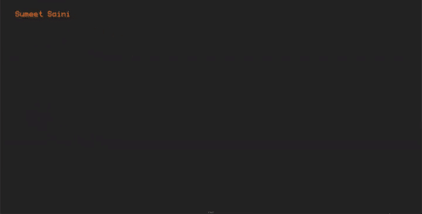

# Sumeet Saini — Interactive 3D Portfolio

A tactile personal portfolio built around a draggable 3D tetrahedron. Each face opens a different part of the site, turning the usual portfolio navigation into a small exploratory interface.

<p>
  <a href="https://sumeetsaini.com"><strong>Explore the live site →</strong></a>
  ·
  <a href="docs/site-demo.mp4"><strong>Watch the full 60 FPS demo</strong></a>
</p>

[](https://sumeetsaini.com)

## Highlights

- **Non-linear 3D navigation** — rotate the tetrahedron and select its faces to explore the site.
- **Custom Three.js geometry** — assembled with `BufferGeometry` and rendered directly in the browser.
- **Momentum-based interaction** — pointer velocity and damping give mouse and touch rotation a physical feel.
- **Quaternion rotation** — smooth orientation changes without gimbal lock.
- **Responsive rendering** — camera placement and interaction adapt across desktop and mobile viewports.
- **Dynamic content panels** — About, Projects, Blog, Contact, and monthly Now updates load without leaving the experience.
- **Two viewing modes** — the interactive “cool” site is paired with a straightforward “simple” presentation.

## How it works

The site is intentionally framework-free. HTML and CSS provide the content shell, while small JavaScript modules handle distinct parts of the experience:

```text
index.html
├── js/shape/       Three.js geometry, animation, and interaction
├── js/controller/  Application state and navigation
├── js/popup/       Content-panel behavior
├── js/projects/    Project portfolio loading
├── js/now/         Monthly update loading
└── content/        About, projects, blog, contact, and Now entries
```

The tetrahedron faces use canvas-composited textures. Drag gestures update its quaternion, momentum carries the rotation after release, and raycasting connects visible faces to their corresponding content.

## Local development

Requirements: Node.js and npm.

```bash
git clone https://github.com/kungfusaini/sumeetsaini_com.git
cd sumeetsaini_com
npm install
npm run dev
```

The development server runs at `http://localhost:8080`.

## Deployment

Production images are defined in `Dockerfile.prod`. The site is deployed as part of [Aether](https://github.com/kungfusaini/aether), my Docker-based hosting platform with Nginx routing and automated deployment.

## Built with

- Three.js
- JavaScript
- HTML and CSS
- Canvas textures
- Docker and Nginx

---

Designed and built by [Sumeet Saini](https://sumeetsaini.com).
